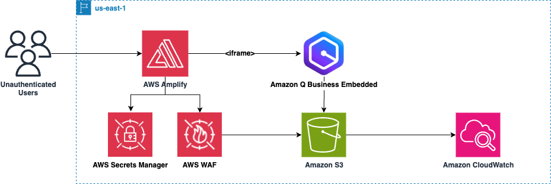
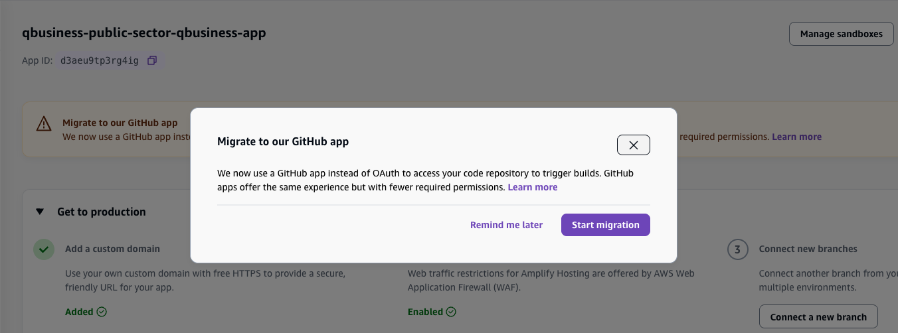

# Amazon Q Business Customized Web Application

[](LICENSE)
[](https://nodejs.org/)
[](https://aws.amazon.com/amplify/)

## Introduction

This scalable solution provides a customized Amazon Q Business web application designed to help public sector agencies securely accelerate their adoption of Generative AI.

The application features **custom theming** for organizational branding and **automatic session management** that creates new **[anonymous chat sessions](https://docs.aws.amazon.com/amazonq/latest/qbusiness-ug/using-web-experience.html#web-experience-anonymous)** for each user visit.

By leveraging Amazon Q Business's [anonymous web experience URLs](https://docs.aws.amazon.com/amazonq/latest/api-reference/API_CreateAnonymousWebExperienceUrl.html), the solution provides secure, temporary access without requiring user authentication.  


## Getting Started

#### Prerequisites:
- AWS Account with appropriate permissions
- Node.js 22+ installed locally
- AWS CLI configured
- Git repository

## Setup

**Step 1: Fork this repository** to your GitHub account (don't just clone)

**Step 2: Clone your fork** locally:
```bash
git clone https://github.com/YOUR_USERNAME/YOUR_FORKED_REPO.git
cd YOUR_FORKED_REPO
npm install
```

**Step 3: Deploy the infrastructure.**

Deployment takes approximately 5-10 minutes.

```bash
./scripts/deploy.sh [stack-name] [branch] [github-repo] [github-token]
```

**Parameters:**
- `stack-name` (optional): CloudFormation stack name (default: "qbusiness-public-sector")
- `branch` (optional): Git branch name (default: "main") 
- `github-repo` (optional): Your **forked** GitHub repository URL (e.g., "https://github.com/username/repo")
- `github-token` (optional): GitHub personal access token ([create one here](https://github.com/settings/personal-access-tokens)) for automatic deployment

**Example with GitHub integration:**
```bash
./scripts/deploy.sh my-stack main "https://github.com/myusername/my-forked-repo" "ghp_xxxxxxxxxxxx"
```

**Example for local development only:**
```bash
./scripts/deploy.sh
```
*Note: Without GitHub integration, this creates Q Business infrastructure and local .env file for development, but no Amplify deployment.*

The script will ask if you have existing Q Business resources and guide you through setup:

```
🏛️  Q Business Public Sector - Unified Deployment
================================================

Do you have existing Q Business resources? (y/n): n

🚀 Creating complete Q Business infrastructure from scratch...
Application name [GovernmentAIAssistant]: My Agency Assistant

Waiting for stack create/update to complete
Successfully created/updated stack - qbusiness-public-sector
✅ Infrastructure deployed successfully!

📤 Uploading theme assets...
✅ Theme assets uploaded successfully

📋 Your configuration:
+---------------------------+-----------------------------------------------------------------------------+
|  AmplifyComputeRoleArn    |  arn:aws:iam::123456789012:role/qbusiness-public-sector-AmplifyComputeRole  |
|  QBusinessApplicationId   |  abcd1234-5678-90ef-ghij-klmnopqrstuv                                       |
|  QBusinessWebExperienceId |  abcd1234-5678-90ef-ghij-klmnopqrstuv|wxyz5678-90ab-cdef-1234-567890abcdef  |
|  AmplifyDefaultDomain     |  https://main.d1a2b3c4d5e6f7.amplifyapp.com                                 |
+---------------------------+-----------------------------------------------------------------------------+

🎉 Deployment complete!

Next steps:
1. Visit your AmplifyDefaultDomain to verify deployment
2. Test locally: npm install && npm start
```

**Step 3: Test locally (optional).**

```bash
npm install && npm start
```

Visit `http://localhost:3000` to test locally.

**Note**: Your Amplify app will auto-deploy when changes are committed to the main branch.

## Reference Architecture



Built with Express.js and deployed on AWS Amplify using CloudFormation for infrastructure management, this demo solution creates a secure, themed Q Business deployment with the following components:

- **Q Business Application**: Anonymous access with custom theming
- **Web Experience**: Customized branding and styling
- **Amplify Hosting**: Server-side rendering with Express.js
- **WAF (Web Application Firewall)**: Security protection for the web application
- **Secrets Manager**: Secure storage of Q Business configuration
- **S3 Bucket**: Theme assets (CSS, fonts, logos)
- **IAM Roles**: Least-privilege permissions for Amplify compute

## Project Structure

```
qbamplify/
├── assets/                 # Theme assets (CSS, fonts, logos)
├── config/                 # Configuration files
├── docs/                   # Documentation
├── infrastructure/         # CloudFormation templates
├── scripts/                # Build and deployment scripts
└── src/                    # Express.js application
```

## Amplify GitHub App Migration

After deployment, you may see this message in the AWS Amplify console:



**Recommendation**: Click the "Start migration" button to migrate to the new GitHub App integration. This provides improved security, better permissions management, and enhanced CI/CD capabilities for your Amplify deployments.

## Cleanup

To remove all AWS resources created by this solution:

```bash
./scripts/cleanup.sh [stack-name]
```

**Parameters:**
- `stack-name` (optional): CloudFormation stack name to delete (default: "qbusiness-public-sector")

**Example:**
```bash
./scripts/cleanup.sh my-stack
```

The script will:
1. Empty the S3 theme assets bucket (all versions)
2. Delete the Secrets Manager secret
3. Delete the CloudFormation stack and all associated resources

## Contributing

See [CONTRIBUTING.md](CONTRIBUTING.md) for contribution guidelines.

## License

This project is licensed under the MIT-0 License. See [LICENSE](LICENSE) for details.

## Security

See [CONTRIBUTING.md](CONTRIBUTING.md#security-issue-notifications) for security issue reporting.