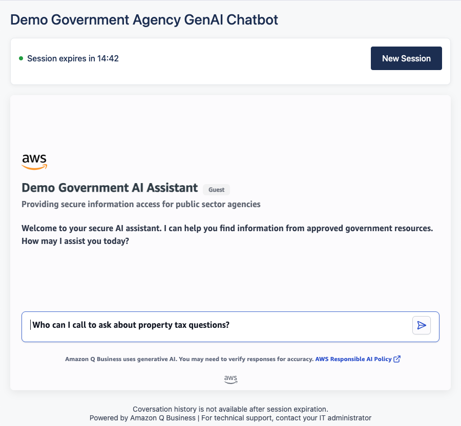

# Amazon Q Business Government Web Application

[](LICENSE)
[](https://nodejs.org/)
[](https://aws.amazon.com/amplify/)

Deploy a government-themed Amazon Q Business web application with complete customization and server-side rendering on AWS Amplify.

## Features

- **Government Theming**: US Web Design System (USWDS) compliant colors
- **Complete Customization**: Logo, fonts, colors, and messaging
- **Server-Side Rendering**: Express.js with AWS Amplify hosting
- **Session Management**: Built-in timer and session controls
- **Mobile Responsive**: Optimized for all device sizes
- **Secure Configuration**: AWS Secrets Manager integration

## Quick Start

Choose your setup path:

### Option 1: I Have Q Business Resources

If you already have a Q Business Application ID and Web Experience ID:

**[→ Setup with Existing Resources](docs/SETUP_EXISTING.md)**

### Option 2: I Need Q Business Resources

If you need to create Q Business resources from scratch:

**[→ Setup with New Resources](docs/SETUP_NEW.md)**

## What You Get



- Professional government-themed interface
- Amazon Ember font integration
- Session management with visual timer
- Government-appropriate sample prompts
- Mobile-responsive design

## Architecture

```mermaid
graph LR
    A[User] --> B[AWS Amplify]
    B --> C[Amazon Q Business]
    B --> D[S3 Theme Assets]
    B --> E[Secrets Manager]
    C --> F[AI Responses]
```

## Project Structure

```
qbamplify/
├── src/                    # Express.js application
├── config/                 # Configuration files
├── scripts/                # Build and deployment scripts
├── assets/                 # Theme assets (CSS, fonts, logos)
├── infrastructure/         # CloudFormation templates
└── docs/                   # Documentation
```

## Documentation

- **[Setup with Existing Resources](docs/SETUP_EXISTING.md)** - Use existing Q Business resources
- **[Setup with New Resources](docs/SETUP_NEW.md)** - Create everything from scratch
- **[AWS Amplify Deployment](docs/AMPLIFY_SETUP.md)** - Deploy to Amplify
- **[Theme Customization](docs/CUSTOMIZATION.md)** - Customize branding and styling
- **[Infrastructure Guide](docs/INFRASTRUCTURE.md)** - CloudFormation details
- **[Project Structure](docs/PROJECT_STRUCTURE.md)** - Directory organization

## Prerequisites

- AWS Account with appropriate permissions
- Node.js 18+ installed locally
- AWS CLI configured
- Git repository

## Local Development

```bash
# Clone and install
git clone <repository-url>
cd qbamplify
npm install

# Configure (see setup guides above)
# Then start locally
npm start
```

Visit `http://localhost:3000` to test locally.

## Deployment

1. **Setup**: Follow one of the setup guides above
2. **Deploy**: Use the [Amplify Deployment Guide](docs/AMPLIFY_SETUP.md)
3. **Customize**: Follow the [Customization Guide](docs/CUSTOMIZATION.md)

## Support

- **Issues**: Use GitHub Issues for bug reports
- **Documentation**: Check the `docs/` directory
- **AWS Support**: Contact AWS Support for service-related issues

## Contributing

See [CONTRIBUTING.md](CONTRIBUTING.md) for contribution guidelines.

## License

This project is licensed under the MIT-0 License. See [LICENSE](LICENSE) for details.

## Security

See [CONTRIBUTING.md](CONTRIBUTING.md#security-issue-notifications) for security issue reporting.